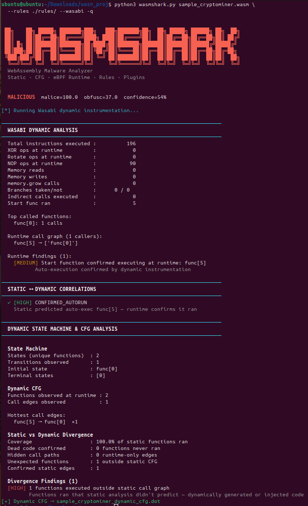

# WASMShark - WebAssembly Malware Analyzer

> *Created as a project at PES University*

Full documentation available at **[wasm-shark.github.io](https://wasm-shark.github.io)**

---


WebAssembly (WASM) has rapidly evolved from a browser technology into a
universal runtime deployed in cloud functions, edge computing, IoT devices etc..

This rapid adoption has made it an attractive target for malware authors 
who exploit WASM's portability and the fact that most security tools have 
no visibility into it.

It combines three analysis layers - static binary analysis, 
Wasabi dynamic instrumentation, and eBPF kernel-level runtime monitoring 
to detect malicious WASM binaries.


### What It Detects

| Threat | Detection Method |
|--------|-----------------|
| Cryptominers | Crypto constants, mining import patterns, pool URLs |
| Ransomware | WASI capability triad, key generation + file rename |
| Droppers | Network recv + file write + exec capability |
| Credential theft | Environment access + network exfiltration |
| Browser attacks | Clipboard hijack, cookie theft, keyloggers |
| Obfuscated loaders | NOP sleds, indirect dispatch, high entropy sections |
| C2 agents | .onion URLs, IRC strings, beacon timing patterns |


---

## Sample Output



---

## Dependencies

```bash
# Python (required)
python3 --version          # needs 3.8+

# eBPF runtime monitor
sudo apt install bpftrace -y

# CFG visualization
sudo apt install graphviz -y

# Wasabi dynamic instrumentation
curl --proto '=https' --tlsv1.2 -sSf https://sh.rustup.rs | sh -s -- -y
source ~/.cargo/env
git clone https://github.com/danleh/wasabi.git
cd wasabi/crates && cargo install --path ./wasabi
cd ..

# Node.js + long.js (for Wasabi)
sudo apt install nodejs npm -y
cd ~/Downloads/wasm_proj
npm install long

# wasmtime (for eBPF runtime demo)
curl https://wasmtime.dev/install.sh -sSf | bash
source ~/.bashrc
```

---

## Project Structure

```
wasmshark/
├── wasmshark.py                  # Main CLI entry point
├── wasmshark_core.py             # Parser, disassembler, CFG, taint, rules
├── wasmshark_advanced.py         # WASI analyzer, loop characterizer
├── wasmshark_cfg_analysis.py     # Dominance tree, SCC, natural loops
├── wasmshark_dynamic.py          # State machine + dynamic CFG from Wasabi
├── wasmshark_wasabi.py           # Wasabi instrumentation integration
├── wasmshark_ebpf.py             # eBPF runtime monitor (bpftrace)
├── wasmshark_watch.py            # File watcher / CI mode
├── generate_samples.py           # Generates synthetic test WASM samples
├── plugins/
│   ├── plugin_call_graph.py
│   ├── plugin_cfg_anomaly.py
│   ├── plugin_cfg_advanced.py
│   ├── plugin_complexity_analyzer.py
│   ├── plugin_memory_behavior.py
│   ├── plugin_memory_safety.py
│   ├── plugin_opcode_anomaly.py
│   └── plugin_string_deobfuscator.py
└── rules/
    ├── rules1.wsr          
    └── rules2.wsr               
```

---

## Quick Start

```bash
# 1. Generate test samples
python3 generate_samples.py

# 2. Basic scan
python3 wasmshark.py sample_cryptominer.wasm

# 3. Full scan with rules + plugins + HTML report
python3 wasmshark.py sample_cryptominer.wasm \
  --rules ./rules/ --plugins ./plugins/ \
  --html --json --sarif

# 4. Open HTML report
xdg-open sample_cryptominer_wasmshark.html
```

---

## Test Commands

### Static Analysis

```bash
# Scan single file — verbose
python3 wasmshark.py sample_cryptominer.wasm -v \
  --rules ./rules/ --plugins ./plugins/

# Scan ransomware sample
python3 wasmshark.py sample_ransomware.wasm \
  --rules ./rules/ --plugins ./plugins/ --html

# Scan all samples — CSV output
python3 wasmshark.py -d . \
  --rules ./rules/ --csv results.csv

# Diff two samples
python3 wasmshark.py sample_cryptominer.wasm \
  --diff sample_ransomware.wasm --rules ./rules/
```

### Wasabi Dynamic Analysis

```bash
# Static + dynamic combined
python3 wasmshark.py sample_cryptominer.wasm \
  --rules ./rules/ --wasabi -q

# Generate and view dynamic CFG
dot -Tpng sample_cryptominer_dynamic_cfg.dot \
    -o sample_cryptominer_dynamic_cfg.png
eog sample_cryptominer_dynamic_cfg.png

# Test multiple samples with Wasabi
for f in sample_cryptominer.wasm sample_browser_cryptojack.wasm; do
  echo "=== $f ==="
  python3 wasmshark.py $f --rules ./rules/ --wasabi -q 2>&1 | \
    grep -E "MALICIOUS|CLEAN|Total instr|Start func|CONFIRMED"
done
```

### eBPF Runtime Monitor

```bash
# Start WASM process
wasmtime run \
  --preload env=loop.wasm \
  --preload memory=loop.wasm \
  cryptominer_live.wasm &
PID=$!
sleep 1

# Monitor with eBPF
sudo env "PATH=$PATH" python3 wasmshark_ebpf.py \
  --pid $PID --bpf --timeout 20 --output runtime.json
```

### W+X Memory Detection

```bash
gcc wx_trigger.c -o wx_trigger

./wx_trigger & PID=$(pgrep -f wx_trigger) && sleep 1 && \
sudo env "PATH=$PATH" python3 wasmshark_ebpf.py \
  --pid $PID --bpf --timeout 15 --output runtime_memory.json

pkill -f wx_trigger
```

### Watch Mode

```bash
python3 wasmshark_watch.py . --rules ./rules/ --interval 2
```

---

## Documentation

Full documentation available at **[wasm-shark.github.io](https://wasm-shark.github.io)**
